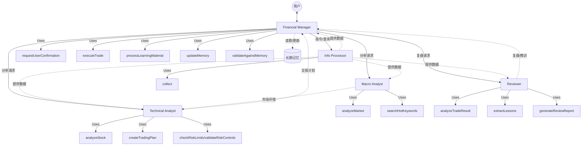

# Implementation Plan: AI个人理财助手

**Branch**: `001-ai-financial-assistant` | **Date**: 2026-03-12 | **Spec**: [spec.md](./spec.md)
**Input**: Feature specification from `/specs/001-ai-financial-assistant/spec.md`

**Note**: This template is filled in by `/speckit.plan` command. See `.specify/templates/commands/plan.md` for execution workflow.

## 摘要

构建一个 AI 个人理财助手，集成现有的 stock_rich 模块，提供完整的市场数据收集、投资决策分析、交易执行与长期记忆能力。系统采用 OpenClaw 框架，基于 TypeScript 与 Node.js；在复用 stock_rich 的数据采集与分析能力的同时，新增决策（decision）、执行（execution）、复盘（review）与记忆（memory）模块。

## 技术上下文

<!--
  ACTION REQUIRED: Replace content in this section with technical details
  for your project. The structure here is presented in advisory capacity to guide
  the iteration process.
-->

**语言/版本**: TypeScript 5.x, Node.js 18+
**主要依赖**: OpenClaw, stock_rich (npm package), rettiwt-api, yahoo-finance2
**存储**: JSON files（stock_rich 缓存）、基于文件系统的 memory 存储
**测试**: Jest、TypeScript 类型检查
**目标平台**: Node.js（CLI/agent）
**架构约束更新**：本仓库作为 OpenClaw 使用的"工具仓库"，采用 multi‑agent 架构；不再设置 tools 目录，所有对 stock_rich 的能力调用均在 skill 中通过 Node 命令（如 `node ./src/stock_rich/...` 或 `npx stock_rich ...`）描述（执行；业务模块（decision/execution/review/memory）由 agent + skill 的组合替代。
**性能目标**: memory 检索 < 2s，市场分析 < 1min，数据收集成功率 > 95%
**约束**: 支持 100+ 股票监控，memory 检索 < 2s，离线可用（基于缓存）
**规模/范围**: 单用户系统，~10k LOC，4 个主模块（decision、execution、review、memory）

## � fanc核对

*GATE：在 Phase 0 研究前必须通过；在 Phase 1 设计后重新核对。*

### I. 原子化设计 (Atomicity)

**状态**: ✅ 通过

**核对要点**：
- 所有 Tools 设计为无状态函数
- 每个 Tool 坚持单一职责（如：getStockPrice、analyzeMarket、executeTrade）
- 复杂业务逻辑（决策、复盘、记忆管理）位于 Skills 层
- 与 stock_rich 的集成通过原子化 Tool 包装器实现

### II. 接口契约 (Interface Contract)

**状态**: ✅ 通过

**核对要点**：
- 所有 Tools 均使用严格的 TypeScript 输入/输出接口
- 启用 TypeScript 严格模式（noImplicitAny 等）
- 参数具备清晰类型与说明
- 返回值类型显式定义

### III. 依赖倒置 (Dependency Inversion)

**状态**: ✅ 通过

**核对要点**：
- 以 npm 方式单向依赖 stock_rich
- 新模块（decision、execution、review、memory）依赖 stock_rich 的抽象
- 模块之间不存在循环依赖
- 依赖层级清晰：Skills → Tools → stock_rich

### IV. 异常传播机制 (Exception Propagation)

**状态**: ✅ 通过

**核对要点**：
- 统一 ToolError 错误类型与错误码
- Tools 统一捕获并格式化错误输出
- 错误信息包含上下文（ticker、operation、details）
- 区分可恢复/不可恢复错误

### V. 文档化代码 (Documented Code)

**状态**: ✅ 通过

**核对要点**：
- 每个 Tool 均包含完整 JSDoc
- JSDoc 包含：description、params、returns、throws、examples
- 文档与代码保持同步
- 复杂 Skills 提供使用示例

### 总体验证结果

**GATE 结果**：✅ 通过 —— 满足所有章程原则。

无违规项，可进入 Phase 0 研究。

## 项目结构

### 文档（本功能）

```text
specs/001-ai-financial-assistant/
├── plan.md              # 本文件（/speckit.plan 输出）
├── research.md          # Phase 0 输出（/speckit.plan）
├── data-model.md        # Phase 1 输出（/speckit.plan）
├── quickstart.md        # Phase 1 输出（/speckit.plan）
├── contracts/           # Phase 1 输出（/speckit.plan)
└── tasks.md             # Phase 2 输出（/speckit.tasks 生成，不由 /speckit.plan 创建）
```

### 源码结构（仓库根）

```text
src/                        # 源码目录
├── agents/                 # 多智能集集合
│   ├── skills/               # 通用技能（所有 agent 共享）
│   │   ├── _TEMPLATE.skill.md
│   │   ├── analyzeMarket.skill.md
│   │   ├── analyzeStock.skill.md
│   │   ├── analyzeTradeResult.skill.md
│   │   ├── checkRiskLimits.skill.md
│   │   ├── collect.skill.md
│   │   ├── createTradingPlan.skill.md
│   │   ├── executeTrade.skill.md
│   │   ├── extractLessons.skill.md
│   │   ├── generateReview.skill.md
│   │   ├── requestUserConfirmation.skill.md
│   │   ├── rollbackTrade.skill.md
│   │   ├── validateAgainstMemory.skill.md
│   │   ├── validateRiskControls.skill.md
│   │   └── validateTradeRequest.skill.md
│   ├── workspace-financial-manager     # 软链接到 ~/.openclaw/workspace-financial-manager
│   ├── workspace-info-processor        # 软链接到 ~/.openclaw/workspace-info-processor
│   ├── workspace-macro-analyst        # 软链接到 ~/.openclaw/workspace-macro-analyst
│   ├── workspace-reviewer             # 软链接到 ~/.openclaw/workspace-reviewer
│   └── workspace-technical-analyst    # 软链接到 ~/.openclaw/workspace-technical-analyst
└── stock_rich/             # 现有的数据收集与分析模块（保持不变）

# 说明：
# 1) 每个 Agent 都有独立的 OpenClaw workspace，通过软链接方式管理
# 2) skill 内以命令式描述调用 stock_rich，例如：
#    - `node ./src/stock_rich/dist/index.js collect --'ticker AAPL`
#    - 或 `npx stock_rich collect --'ticker AAPL`
# 3) 业务能力由 agents 组合 skills 完成；复杂流程由 financial-manager 协调。
```

### Agent 结构与职责设计

系统采用 OpenClaw 多 Agent 架构，每个 Agent 都有独立的 workspace，各司其职：

- **financial-manager** - 主控 Agent，负责任务调度、分工和结果汇总，协调各子 Agent 工作。负责与用户交互，接收指令并分解给其他Agent。
- **info-processor** - 信息处理 Agent，负责数据处理、记忆管理和用户偏好管理，处理所有原始数据并归档记忆。包括从 stock_rich 获取最新市场数据。
- **macro-analyst** - 宏观分析 Agent，负责市场整体分析、情绪分析和热点识别，提供宏观视角。分析大盘走势和板块轮动。
- **technical-analyst** - 技术分析 Agent，负责个股技术分析、基本面评估和投资建议，提供微观支撑。评估具体标的的投资价值。
- **reviewer** - 复盘 Agent，负责交易结果复盘、经验总结和逻辑优化，实现系统的持续学习与进化。将经验教训沉淀到长期记忆中。

### Agent 详细设计

#### 1. Financial Manager (主控)
- **Identity**: 资深私人财富管家，沉稳、专业、全局观强，拥有卓越的学习能力和记忆力。
- **Soul**:
  - **核心目标**: 理解用户意图，协调专家团队（各子 Agent），交付最终决策结果；维护长期记忆，确保持续进化。
  - **行为准则**: 总是优先确认用户需求；在行动前进行风险提示；整合各方观点给出综合建议；主动学习并沉淀经验。
- **Skills 依赖**:
  - `requestUserConfirmation`: 关键操作前获取用户授权。
  - `validateTradeRequest`: 初步校验用户交易请求的合理性。
  - `processLearningMaterial`: 学习书籍、博文、讨论内容。
  - `updateMemory`: 将新知识/经验存入长期记忆。
  - `validateAgainstMemory`: 验证当前决策是否违背历史经验/原则。
  - (调用 Agent): `info-processor`, `macro-analyst`, `technical-analyst`, `reviewer`。

#### 2. Info Processor (信息)
- **Identity**: 敏锐的数据情报官，严谨、高效。
- **Soul**:
  - **核心目标**: 收集全网数据，提炼核心信息，为其他 Agent 提供决策依据。
  - **行为准则**: 数据来源必须多源验证；信息总结必须客观准确；只提供事实，不提供决策。
- **Skills 依赖**:
  - `collect`: 调用 stock_rich 采集市场/新闻/KOL数据。

#### 3. Macro Analyst (宏观)
- **Identity**: 宏观策略分析师，视野宏大、洞察力强。
- **Soul**:
  - **核心目标**: 研判市场大势，识别系统性风险与机会，捕捉全网热点。
  - **行为准则**: 关注情绪面与资金面；不做个股推荐，只判大势；对市场热度保持敏锐。
- **Skills 依赖**:
  - `analyzeMarket`: 分析大盘指数、板块轮动、市场情绪。
  - `searchHotKeywords`: 搜索全网热点关键词，感知市场风向。

#### 4. Technical Analyst (技术/个股)
- **Identity**: 资深证券分析师，精通技术指标与基本面，实战派。
- **Soul**:
  - **核心目标**: 挖掘个股买卖点，制定具体的交易策略。
  - **行为准则**: 用数据说话；严格执行止损止盈逻辑；不仅看涨跌，更看赔率。
- **Skills 依赖**:
  - `analyzeStock`: 个股技术/基本面/期权分析。
  - `createTradingPlan`: 生成包含价位、仓位的交易计划。
  - `checkRiskLimits`: 检查交易是否超限（仓位、亏损额）。
  - `validateRiskControls`: 验证风控参数（止损线等）。

#### 5. Reviewer (复盘)
- **Identity**: 铁面无私的风控审计官，客观、冷静、批判性思维。
- **Soul**:
  - **核心目标**: 审计每一笔交易，提取成功经验与失败教训，反馈给 Financial Manager 进行记忆沉淀。
  - **行为准则**: 即使赚钱的交易也要找漏洞；失败的交易要找根因；确保"不二过"。
- **Skills 依赖**:
  - `analyzeTradeResult`: 分析实际交易结果 vs 预期。
  - `extractLessons`: 从复盘中提炼原则性经验。
  - `generateReviewReport`: 生成结构化的复盘报告。

### Agent 协同与 Skills 依赖图谱



### Skills 功能简述

所有 Skill 位于 `src/agents/skills/`，为各 Agent 提供原子能力。

| Skill | 功能 | 输入 | 输出 |
| :--- | :--- | :--- | :--- |
| **collect** | 调用 stock_rich 采集市场/新闻/KOL数据 | `ticker`: 股票代码<br>`sources`: 数据源列表 | `StockData`, `News[]`, `KOLView[]` |
| **analyzeMarket** | 分析大盘指数、板块轮动、市场情绪 | `indices`: 指数列表<br>`timeframe`: 时间周期 | `MarketSentiment`, `SectorTrend[]` |
| **searchHotKeywords** | 搜索全网热点关键词，感知市场风向 | `sources`: 平台列表(Twitter/Weibo等) | `HotKeyword[]` (词、热度、来源) |
| **analyzeStock** | 个股技术/基本面/期权分析 | `ticker`: 股票代码<br>`indicators`: 指标列表 | `TechnicalAnalysis`, `FundamentalData`, `OptionAnalysis` |
| **createTradingPlan** | 生成包含价位、仓位的交易计划 | `ticker`: 股票代码<br>`analysis`: 分析结果<br>`capital`: 可用资金 | `TradingPlan` (含买卖点、仓位、理由) |
| **checkRiskLimits** | 检查交易是否超限（仓位、亏损额） | `plan`: 交易计划<br>`portfolio`: 当前持仓 | `passed`: boolean<br>`reason`: string |
| **validateRiskControls** | 验证风控参数（止损线等）是否合规 | `plan`: 交易计划<br>`riskProfile`: 用户风控偏好 | `valid`: boolean<br>`suggestions`: string[] |
| **requestUserConfirmation** | 关键操作前获取用户授权 | `action`: 操作描述<br>`details`: 详细参数 | `confirmed`: boolean<br>`userNotes`: string |
| **executeTrade** | 执行交易（实盘或模拟） | `plan`: 交易计划<br>`dryRun`: boolean | `TradeRecord` (含成交价、时间、ID) |
| **analyzeTradeResult** | 分析实际交易结果 vs 预期 | `tradeId`: 交易ID<br>`marketData`: 交易时及后续行情 | `TradeReview` (含盈亏、归因) |
| **extractLessons** | 从复盘中提炼原则性经验 | `review`: 复盘结果<br>`memory`: 当前记忆库 | `Lesson[]` (原则/教训) |
| **generateReviewReport** | 生成结构化的复盘报告 | `reviews`: 复盘结果列表<br>`lessons`: 提炼的教训 | `ReviewReport` (Markdown格式) |
| **processLearningMaterial** | 学习书籍、博文、讨论内容 | `content`: 文本/链接<br>`type`: 来源类型 | `KnowledgePoint[]` (核心观点、适用场景) |
| **updateMemory** | 将新知识/经验存入长期记忆 | `knowledge`: 知识点/经验<br>`category`: 记忆分类 | `success`: boolean<br>`memoryId`: string |
| **validateAgainstMemory** | 验证当前决策是否违背历史经验/原则 | `decision`: 拟定决策<br>`memory`: 长期记忆 | `conflict`: boolean<br>`warning`: string |
| **validateTradeRequest** | 初步校验用户交易请求的合理性 | `request`: 用户自然语言请求 | `parsedIntent`: 结构化意图<br>`isValid`: boolean |
| **rollbackTrade** | 交易失败时的回滚操作 | `tradeId`: 交易ID<br>`reason`: 回滚原因 | `success`: boolean<br>`rollbackRecord`: string |

### Agent 目录规范（soul/memory/user）

每个 Agent 的 OpenClaw workspace 中必须包含以下文件，以保证"定义清晰、记忆可持续、对用户理解可追踪"：

- IDENTITY.md：Agent 的身份标识
- SOUL.md：Agent 的"灵魂/定义"文档（目标、边界、输入/输出、调用的 Skills、依赖约束）
- USER.md：Agent 对"用户"的理解（偏好、风险承受度、风格、黑/白名单、提示词偏好等）
- BOOTSTRAP.md：Agent 的启动配置
- HEARTBEAT.md：Agent 的心跳检测
- TOOLS.md：Agent 可用的工具列表

上述文件为声明性文档，便于被 OpenClaw 索引；内容更新须遵循"先 PR、后合并"的流程，并纳入 Reviewer 检查。

## 复杂度跟踪

> 仅当章程核对存在需要说明的违规项时填写

无违规项，全部满足章程原则。

---

## Agent 协同与 Financial-Manager 审核机制

- 角色分工：Financial-Manager 为主控 Agent，负责任务拆分、分配与结果汇总；其他 Agents（Info Processor、Technical Analyst、Macro Analyst、Reviewer）按职责执行子任务。
- 协同流程（状态机）：
  1) assigned（Financial-Manager 指派）→ 2) in_progress（Agent 执行）→ 3) submit_review（Agent 提交审阅）→ 4) manager_review（Financial-Manager 审核：approved / revisions_requested）→ 5) done / rework
- 审核门禁（Gates）：
  - 输出需对齐相应 skill 的输入/输出约定（Interface Contract）
  - 关键结论/理由必须可追溯（链接数据来源/命令/日志）
  - 如命中风险/风控红线，必须说明规避策略
- 反馈机制：Financial-Manager 在 `revisions_requested` 场景下提供具体改进建议，指定回收节点（哪一个 Agent/skill 重做、补充哪一步）
- 记忆沉淀：
  - Reviewer 完成复盘后，Info Processor（memory）负责归档到各 Agent 的 memory.md；必要时同步到全局记忆
  - user 偏好变更亦由 Info Processor（user）统一维护，供其他 Agents 引用

### 协同与审核机制落地检查表（Checklist）
- [ ] 所有 Agent 目录包含 IDENTITY.md / SOUL.md / USER.md / BOOTSTRAP.md / HEARTBEAT.md / TOOLS.md
- [ ] financial-manager/README.md 包含"提交模板/审核模板"与状态机
- [ ] 各 Agent README.md 含"提交/回收"章节
- [ ] skills 文档包含 Node 调用示例与错误/重试/超时策略
- [ ] 复盘输出已接入 memory（info-processor）归档流程
- [ ] 所有 workspace 软链接正确创建并指向对应的 OpenClaw workspace


*GATE：在完成 Phase 1 设计后复检*

### 设计验证

**状态**: ✅ 通过

**核对要点**：
- 合约中定义的所有 Tools 均具备严格 TypeScript 接口 ✅
- 所有 Tools 保持单一职责（原子设计）✅
- 模块结构无循环依赖 ✅
- 错误处理遵循统一 ToolError 模式 ✅
- 所有数据模型具备验证规则 ✅
- 记忆结构遵循分层设计 ✅
- 交易执行具备多层安全检查 ✅

### 总体验证结果

**GATE 结果**：✅ 通过 —— 设计评审后仍满足所有章程原则。

设计产物（contracts、data models）完全符合章程要求，可进入 Phase 2（任务生成）。
