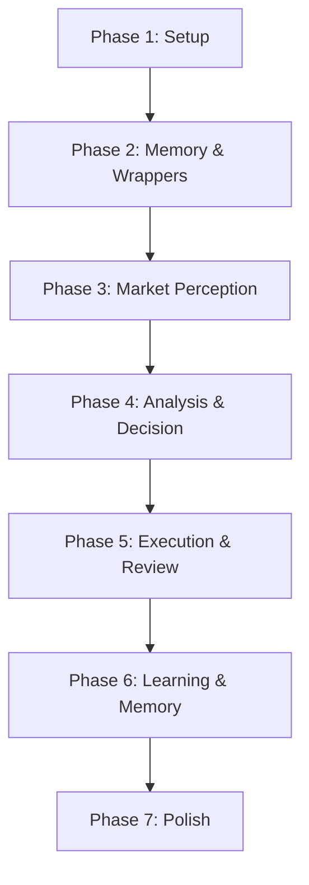

# 任务清单：AI 个人理财助手

**功能分支**: `001-ai-financial-assistant`
**状态**: 待执行
**来源**: [spec.md](./spec.md), [plan.md](./plan.md)

## 执行策略

我们将分阶段实施系统，首先建立核心基础设施和记忆系统，然后从数据收集开始，逐步构建分析、执行，最后实现学习闭环。

1. **Setup**: 初始化项目结构和共享工具。
2. **Foundational**: 实现记忆系统（所有 Agent 的核心依赖）和 `stock_rich` 适配器。
3. **Market Perception (US1)**: 实现数据收集和热点感知能力。
4. **Decision Making (US2)**: 实现分析和预案制定 Agent。
5. **Execution (US3)**: 实现交易执行和复盘 Agent。
6. **Learning (US4)**: 实现长期记忆迭代和外部学习能力。

---

## 阶段 1：初始化与基础设施 (Setup)

- [ ] T001 [P] 实现按日数据路径生成和读写工具于 `src/utils/dailyStorage.ts`
- [ ] T002 [P] 根据 data-model.md 创建共享类型定义于 `src/types/domain.ts`
- [ ] T003 [P] 实现带验证的配置加载器于 `src/utils/config.ts`
- [ ] T004 [P] 实现标准化的 `ToolError` 类和错误处理工具于 `src/utils/error.ts`
- [ ] T005 创建 Agent 基础配置模板（IDENTITY/SOUL/USER/TOOLS/BOOTSTRAP）于 `src/agents/templates/`

## 阶段 2：基础能力 (Foundational - Memory & Data Layer)

*依赖：阶段 1*

- [ ] T006 [P] 实现 MemoryNode 和 MemoryIndex 接口于 `src/types/memory.ts`
- [ ] T007 实现基于文件的 JSON 记忆存储机制于 `src/utils/storage.ts` (Financial Manager Workspace)
- [ ] T008 实现 `storeMemory` Skill 逻辑于 `src/agents/skills/memory/storeMemory.ts`
- [ ] T009 实现 `retrieveMemory` Skill 逻辑（含基础索引）于 `src/agents/skills/memory/retrieveMemory.ts`
- [ ] T010 实现 `updateMemory` Skill 逻辑于 `src/agents/skills/memory/updateMemory.ts`
- [ ] T011 [P] 创建 `stock_rich` 市场数据（股票、新闻）适配器于 `src/utils/stockRichAdapter.ts`
- [ ] T012 [P] 创建 `stock_rich` 期权数据适配器于 `src/utils/optionAdapter.ts`

## 阶段 3：[US1] 市场信息感知 (Market Perception)

*目标：使系统具备收集和整理市场数据的能力。*
*依赖：阶段 2*

- [ ] T013 [US1] 配置 `info-processor` Agent：创建 IDENTITY.md, SOUL.md, USER.md, TOOLS.md 于 `src/agents/workspace-info-processor/`
- [ ] T014 [P] [US1] 实现 `collect` Skill（集成 stock_rich 并输出到 Daily Storage）于 `src/agents/skills/collect.ts`
- [ ] T015 [US1] 实现 `searchHotKeywords` Skill 逻辑于 `src/agents/skills/searchHotKeywords.ts`
- [ ] T016 [US1] 创建 Info Processor 数据收集的集成测试于 `tests/integration/us1_perception.test.ts`

## 阶段 4：[US2] 投资决策分析 (Analysis & Decision)

*目标：实现市场分析和交易预案制定。*
*依赖：阶段 3*

- [ ] T017 [US2] 配置 `macro-analyst` Agent：创建 IDENTITY.md, SOUL.md, USER.md, TOOLS.md 于 `src/agents/workspace-macro-analyst/`
- [ ] T018 [US2] 配置 `technical-analyst` Agent：创建 IDENTITY.md, SOUL.md, USER.md, TOOLS.md 于 `src/agents/workspace-technical-analyst/`
- [ ] T019 [P] [US2] 实现 `analyzeMarket` Skill 逻辑（从 Daily Storage 读取）于 `src/agents/skills/analyzeMarket.ts`
- [ ] T020 [P] [US2] 实现 `analyzeStock` Skill 逻辑（从 Daily Storage 读取）于 `src/agents/skills/analyzeStock.ts`
- [ ] T021 [US2] 实现 `validateRiskControls` Skill 逻辑于 `src/agents/skills/validateRiskControls.ts`
- [ ] T022 [US2] 实现 `checkRiskLimits` Skill 逻辑于 `src/agents/skills/checkRiskLimits.ts`
- [ ] T023 [US2] 实现 `createTradingPlan` Skill 逻辑（输出到 Daily Storage）于 `src/agents/skills/createTradingPlan.ts`
- [ ] T024 [US2] 创建分析与决策流程的集成测试于 `tests/integration/us2_analysis.test.ts`

## 阶段 5：[US3] 交易执行与复盘 (Execution & Review)

*目标：实现安全的交易执行和结果复盘。*
*依赖：阶段 4*

- [ ] T025 [US3] 配置 `financial-manager` Agent：创建 IDENTITY.md, SOUL.md, USER.md, TOOLS.md, MEMORY.md 于 `src/agents/workspace-financial-manager/`
- [ ] T026 [US3] 配置 `reviewer` Agent：创建 IDENTITY.md, SOUL.md, USER.md, TOOLS.md 于 `src/agents/workspace-reviewer/`
- [ ] T027 [P] [US3] 实现 `validateTradeRequest` Skill 逻辑于 `src/agents/skills/validateTradeRequest.ts`
- [ ] T028 [P] [US3] 实现 `requestUserConfirmation` Skill 逻辑（CLI 交互）于 `src/agents/skills/requestUserConfirmation.ts`
- [ ] T029 [US3] 实现 `executeTrade` Skill 逻辑（模拟/Mock，记录到 Daily Storage）于 `src/agents/skills/executeTrade.ts`
- [ ] T030 [P] [US3] 实现 `rollbackTrade` Skill 逻辑于 `src/agents/skills/rollbackTrade.ts`
- [ ] T031 [US3] 实现 `analyzeTradeResult` Skill 逻辑（从 Daily Storage 读取）于 `src/agents/skills/analyzeTradeResult.ts`
- [ ] T032 [P] [US3] 实现 `generateReviewReport` Skill 逻辑（生成周报/日报）于 `src/agents/skills/generateReviewReport.ts`
- [ ] T033 [US3] 创建执行与复盘流程的集成测试于 `tests/integration/us3_execution.test.ts`

## 阶段 6：[US4] 长期记忆与持续学习 (Learning & Memory)

*目标：从经验和外部来源中学习，实现系统进化。*
*依赖：阶段 5*

- [ ] T034 [P] [US4] 实现 `extractLessons` Skill 逻辑于 `src/agents/skills/extractLessons.ts`
- [ ] T035 [P] [US4] 实现 `validateAgainstMemory` Skill 逻辑于 `src/agents/skills/validateAgainstMemory.ts`
- [ ] T036 [US4] 实现 `processLearningMaterial` Skill 逻辑于 `src/agents/skills/processLearningMaterial.ts`
- [ ] T037 [US4] 增强 `updateMemory` 以支持学习沉淀于 `src/agents/skills/memory/updateMemory.ts`
- [ ] T038 [US4] 在 Financial Manager 中集成学习闭环逻辑于 `src/agents/workspace-financial-manager/soul.md`
- [ ] T039 [US4] 创建学习闭环的集成测试于 `tests/integration/us4_learning.test.ts`

## 阶段 7：打磨与集成 (Polish)

- [ ] T040 创建助手的主 CLI 入口点于 `src/index.ts`
- [ ] T041 创建文档更新脚本以维护 `AGENTS.md`
- [ ] T042 进行最终的端到端系统测试，验证所有 Agent 协作

## 依赖关系图

